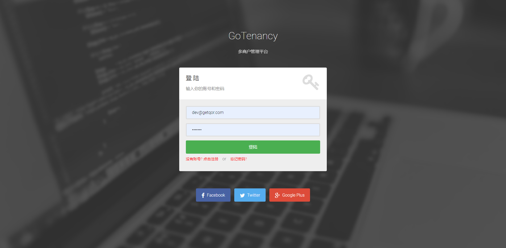
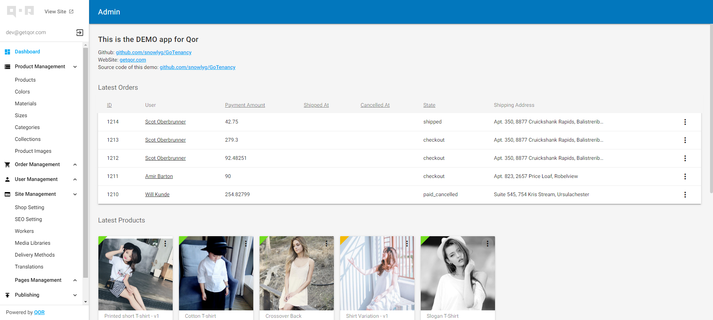

<h1 align="center">GoTenancy</h1>

<div align="center">
    <a href="https://travis-ci.org/snowlyg/GoTenancy"></a>
    <a href="https://codecov.io/gh/snowlyg/GoTenancy"></a>
    <a href="https://goreportcard.com/report/github.com/snowlyg/GoTenancy"></a>
    <a href="https://godoc.org/github.com/snowlyg/GoTenancy"></a>
    <a href="https://github.com/snowlyg/GoTenancy/blob/master/LICENSE"></a>
    <h5 align="center">多商户管理平台</h5>
</div>

#### 项目介绍  【项目目前仍在开发中】
> 本来采用此项目是从 [IrisAdminApi](https://github.com/snowlyg/IrisAdminApi) 升级而来。在开发过程中遇到一个问题：gorm 的多对多关系中间表中自定义字段。
> 在搜索的过程中无意间发现了 [gorm](https://gorm.io/zh_CN/docs/index.html) 作者团队的 CMS 框架 [Qor-Admin](https://github.com/qor/admin) ,文档请见 [https://doc.getqor.com/](https://doc.getqor.com/)。
> 一见到 `Qor-Admin` 框架，我就决定使用它重构我的项目了,它有很多值得我去深入了解的地方。 —— 不想偷懒的程序员无法成为一个优秀的程序员。
> `Qor-Admin` 可以单独使用，也可以和其他框架结合使用。本项目采用 `Iris 结合 Qor-Admin` 形式开发，其他框架大同小异。
> 参考项目：[qor-example](https://github.com/qor/qor-example)
> 
> [qor-example](https://github.com/qor/qor-example) 是一个购物商城实例，目前已经使用 iris 重构了路由 （有部分问题未修复），详细代码位于 [devForQor](https://github.com/snowlyg/GoTenancy/tree/devForQor) 分支。
> 
> [qor](https://github.com/qor/qor) 整体框架组件十分的完善，实现了大部分的功能。当然，框架做了太多事情，随之而来的问题也会很多。我在使用过程中总结了一些问题都集中记录在 [问题记录](ERRORS.MD) 中。
> 
---


#### iris + qor-admin 使用案例 【 代码由 iris 的作者 @kataras 提供】
> 提供一个我翻译的 iris'wiki 中文文档，方便大家学习 iris : 

- [learnku.com 论坛地址](https://learnku.com/docs/iris-wiki/v12)
- [github 地址](https://github.com/snowlyg/iris/wiki)

---
也欢迎加入 Iris-go 学习交流QQ群，一起交流学习心得 ：676717248 

<a target="_blank" href="//shang.qq.com/wpa/qunwpa?idkey=cc99ccf86be594e790eacc91193789746af7df4a88e84fe949e61e5c6d63537c"></a>

```go
package main

import (
    "github.com/kataras/iris/v12"
    "github.com/qor/admin"
)

func main() {
    app := iris.New()

    qorPrefix := "/admin"
    // create a new qor admin instance.
    q := admin.New(&admin.AdminConfig{DB: yourDB})
    // create a qor handler and convert it to an iris one with `iris.FromStd`.
    handler := iris.FromStd(q.NewServeMux(qorPrefix))
    // register routes for "/admin" and "/admin/:xxx/..."
    app.Any(qorPrefix, handler)
    app.Any(qorPrefix+"/{p:path}", handler)

    // start the server.
    app.Listen(":8080")
}

```

#### 项目目录结构
- 项目重构中....

---

#### 更新日志
[日志](UPDATE.MD)
---

#### 问题总结
[问题记录](ERRORS.MD)

---

#### 项目初始化

>拉取项目

```shell script

git clone https://github.com/snowlyg/GoTenancy.git

// github 克隆太慢可以用 gitee 地址:

git clone https://gitee.com/dtouyu/GoTenancy.git

```

> 加载依赖管理包 (解决国内下载依赖太慢问题)
> golang 1.13 可以直接执行：

```shell script

go env -w GO111MODULE=on
go env -w GOPROXY=https://goproxy.cn,direct

```

> 修改 `GoTenancy/config` 下的配置文件 :
> application.yml - 应用配置 
> database.yml - 数据配置 
> smtp.yml - 邮箱配置 


> 加载数据 

```shell script

go run config/db/seeds/main.go config/db/seeds/seeds.go

```

> 打包模版文件和静态文件 

```shell script

go run main.go -compile-templates=true  //模版文件


# windows 环境如果安装失败,请尝试运行：
# npm install -g node-gyp
# npm install --global --production windows-build-tools

npm install  //安装 npm 依赖
npm run build  //打包静态文件

```


> 运行项目 

[gowatch](https://gitee.com/silenceper/gowatch)
```shell script

go get github.com/silenceper/gowatch

gowatch //安装 gowatch 后才可以使用

```

当然你也可以直接使用，此方法无法热加载

```shell script

go run main.go

```

#### 账号密码 
> dev@getqor.com / testing

---


#### 演示
> 登录页： http://localhost:8080/admin/login




> 控制面板： http://localhost:8080/admin



